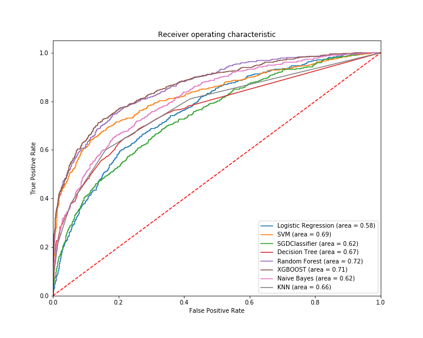

## [_Bank customer data_](https://github.com/NMShihab/Case_Study_with_mechine_learning_and_deep_learning/tree/master/Bank_data)

## **[_Analysis Data_](https://github.com/NMShihab/Case_Study_with_mechine_learning_and_deep_learning/blob/master/Bank_data/Analysis_of_data.ipynb)**

## **[_Machine Learning Algorithm and their evalution table :_](https://github.com/NMShihab/Case_Study_with_mechine_learning_and_deep_learning/blob/master/Bank_data/Machine_learning_models.ipynb)**

|  NO  |   Algorithm Name   |   Type    | Highest accuracy | Precision for 0  | Precision for 1  |
| :--- | :----------------- | :-------- | :--------------- | :--------------- | :--------------- |
|  1   | Logistic Regresson | Clssifier |      0.817       |      0.83        |      0.61        |
|  2   |       SVM          | Clssifier |      0.867       |      0.87        |      0.84        |
|  3   |   SGDClassifier    | Clssifier |      0.819       |      0.83        |      0.61        |
|  4   |   DecisionTree     | Clssifier |      0.826       |      0.87        |      0.58        |
|  5   |   Random Forest    | Clssifier |      0.870       |      0.88        |      0.78        |
|  6   |      XGBOOST       | Clssifier |      0.868       |      0.88        |      0.78        |
|  7   |  Naive Bayes       | Clssifier |      0.839       |      0.85        |      0.75        |
|  8   |      KNN           | Clssifier |      0.845       |      0.86        |      0.70        |

## _Performance Measure graph_

**Accourding to this table and the graph  _Random Forest_ gives us better result**

## Note : Model always choose accourding to its business purpuse
